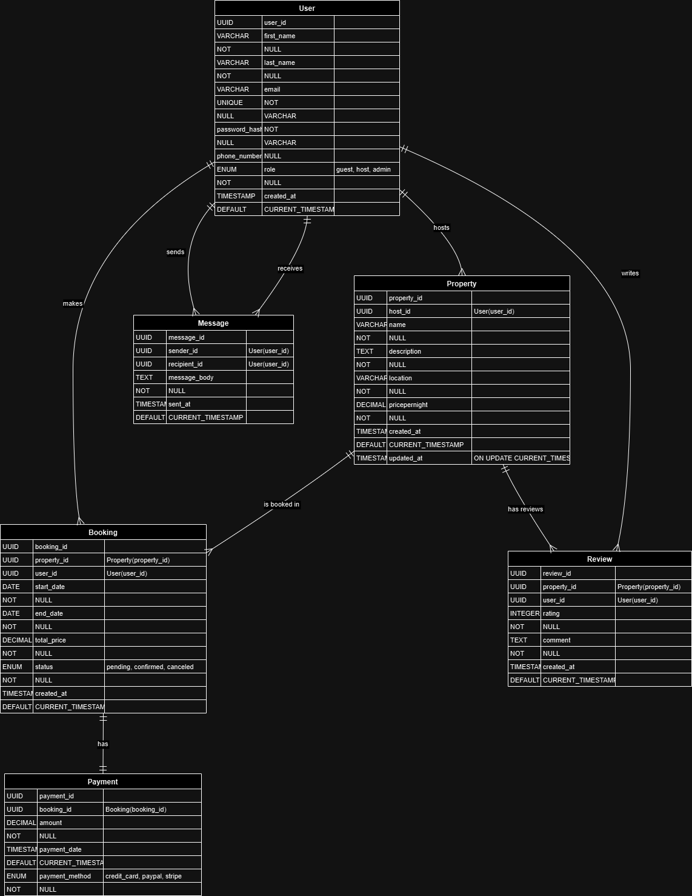

# Entity-Relationship Diagram (ERD)

## Objective

The goal is to create an Entity-Relationship Diagram (ERD) based on the given database specification for the AirBnB project.

---

## Entities and Attributes

### User

- **user_id**: Primary Key (UUID)
- **first_name**: VARCHAR, NOT NULL
- **last_name**: VARCHAR, NOT NULL
- **email**: VARCHAR, UNIQUE, NOT NULL
- **password_hash**: VARCHAR, NOT NULL
- **phone_number**: VARCHAR, NULL
- **role**: ENUM ('guest', 'host', 'admin'), NOT NULL
- **created_at**: TIMESTAMP, DEFAULT CURRENT_TIMESTAMP

### Property

- **property_id**: Primary Key (UUID)
- **host_id**: Foreign Key, references User(user_id)
- **name**: VARCHAR, NOT NULL
- **description**: TEXT, NOT NULL
- **location**: VARCHAR, NOT NULL
- **pricepernight**: DECIMAL, NOT NULL
- **created_at**: TIMESTAMP, DEFAULT CURRENT_TIMESTAMP
- **updated_at**: TIMESTAMP, ON UPDATE CURRENT_TIMESTAMP

### Booking

- **booking_id**: Primary Key (UUID)
- **property_id**: Foreign Key, references Property(property_id)
- **user_id**: Foreign Key, references User(user_id)
- **start_date**: DATE, NOT NULL
- **end_date**: DATE, NOT NULL
- **total_price**: DECIMAL, NOT NULL
- **status**: ENUM ('pending', 'confirmed', 'canceled'), NOT NULL
- **created_at**: TIMESTAMP, DEFAULT CURRENT_TIMESTAMP

### Payment

- **payment_id**: Primary Key (UUID)
- **booking_id**: Foreign Key, references Booking(booking_id)
- **amount**: DECIMAL, NOT NULL
- **payment_date**: TIMESTAMP, DEFAULT CURRENT_TIMESTAMP
- **payment_method**: ENUM ('credit_card', 'paypal', 'stripe'), NOT NULL

### Review

- **review_id**: Primary Key (UUID)
- **property_id**: Foreign Key, references Property(property_id)
- **user_id**: Foreign Key, references User(user_id)
- **rating**: INTEGER, CHECK rating >= 1 AND rating <= 5, NOT NULL
- **comment**: TEXT, NOT NULL
- **created_at**: TIMESTAMP, DEFAULT CURRENT_TIMESTAMP

### Message

- **message_id**: Primary Key (UUID)
- **sender_id**: Foreign Key, references User(user_id)
- **recipient_id**: Foreign Key, references User(user_id)
- **message_body**: TEXT, NOT NULL
- **sent_at**: TIMESTAMP, DEFAULT CURRENT_TIMESTAMP

---

## Relationships

- **User → Property**: One user (host) can list many properties.
- **User → Booking**: One user (guest) can make many bookings.
- **Property → Booking**: One property can be booked many times.
- **Booking → Payment**: One booking can have one payment.
- **Property → Review**: One property can have many reviews.
- **User → Review**: One user can write many reviews.
- **User → Message**: One user can send many messages (sender/recipient).

---

## Entity-Relationship Diagram

Below is the visual representation of the ERD:

---

## Instructions for Viewing

1. Open the repository in your browser or clone it locally.
2. Navigate to the `ERD` directory.
3. View the image file `airbnb-erd.png` to see the ER diagram.
